# n8n Automation Platform -- Google Calendar Cleanup (Oracle Cloud Free Tier)

## Overview

Este proyecto demuestra cómo desplegar una plataforma de automatización
basada en **n8n** utilizando infraestructura gratuita en **Oracle Cloud
Infrastructure (OCI)**.

La arquitectura integra:

- Cloud Infrastructure
- Docker containers
- Public DNS
- OAuth authentication with Google
- Automation of Google Calendar events

Todo el sistema opera **24/7 sin coste**, utilizando exclusivamente
servicios del **Free Tier**.

---

# Architecture

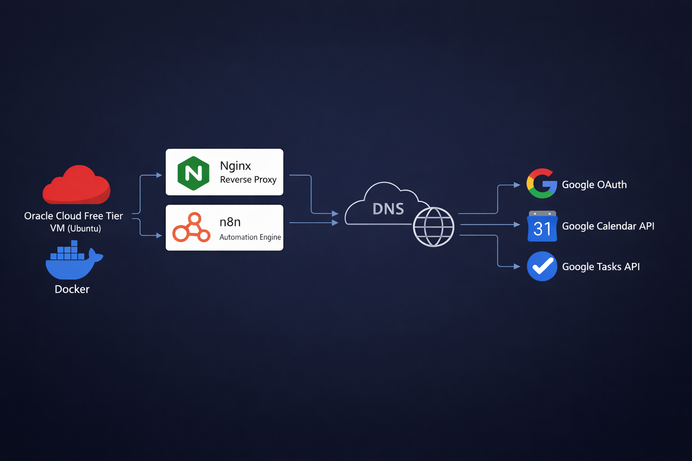

La plataforma está desplegada en Oracle Cloud Infrastructure utilizando
una máquina virtual del Free Tier.

El tráfico fluye desde Internet a través de un registro DNS gestionado
por ClouDNS, el cual apunta a la dirección IP pública de la máquina
virtual en Oracle Cloud.

Dentro de la máquina virtual, los servicios se ejecutan en contenedores
Docker:

- Nginx (reverse proxy)
- n8n (motor de automatización)

El workflow de n8n se autentica con Google mediante OAuth e interactúa
con:

- Google Calendar API
- Google Tasks API

La automatización se ejecuta diariamente y elimina eventos y tareas
vencidas.

---

# Infrastructure

## Cloud Provider

Servidor desplegado en **Oracle Cloud Infrastructure (Free Tier)**.

## Virtual Machine

Características principales:

- Ubuntu Linux
- Public IP address
- SSH key authentication

---

# System Configuration

## Actualización inicial del sistema

```bash
sudo apt update
sudo apt upgrade -y
```

## Acceso SSH al servidor

La máquina virtual se administra mediante acceso **SSH** utilizando
autenticación por clave.

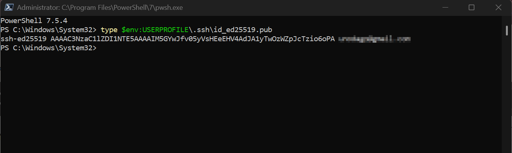

Conexión desde la máquina local:

```bash
ssh ubuntu@<public-ip>
```

Ejemplo:

```bash
ssh ubuntu@152.xxx.xxx.xxx
```

Si se utiliza una clave privada SSH:

```bash
ssh -i ~/.ssh/oci-key.pem ubuntu@<public-ip>
```

Este acceso permite administrar el sistema y ejecutar las tareas de
instalación y configuración del servidor.

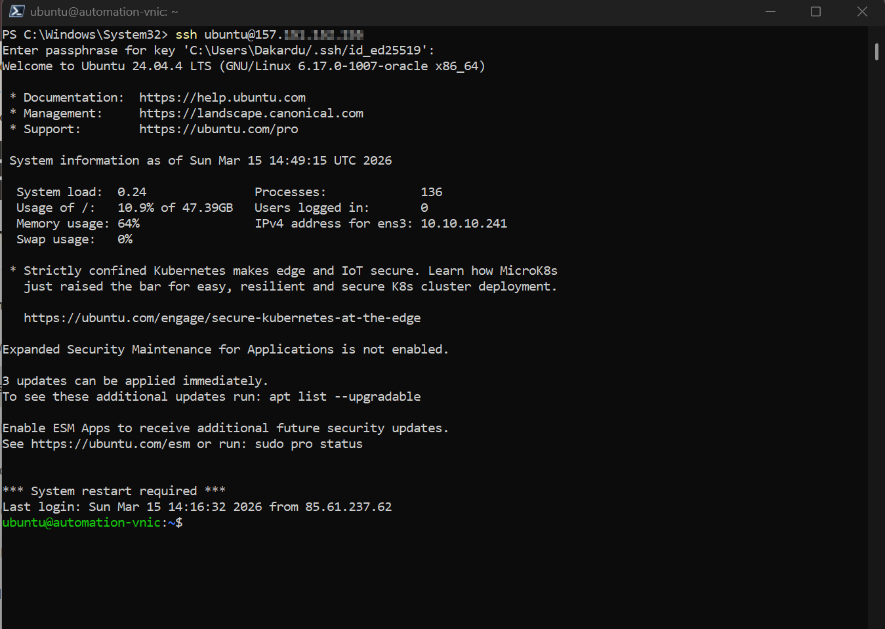

## Instalación de Docker para ejecutar servicios containerizados

```bash
sudo apt install docker.io -y
```

Verificar instalación:

```bash
docker --version
```

Habilitar Docker al iniciar el sistema:

```bash
sudo systemctl enable docker
sudo systemctl start docker
```

Agregar el usuario al grupo Docker para evitar usar sudo:

```bash
sudo usermod -aG docker $USER
```

Aplicar cambios de grupo:

```bash
newgrp docker
```

Probar ejecución de contenedores:

```bash
docker run hello-world
```

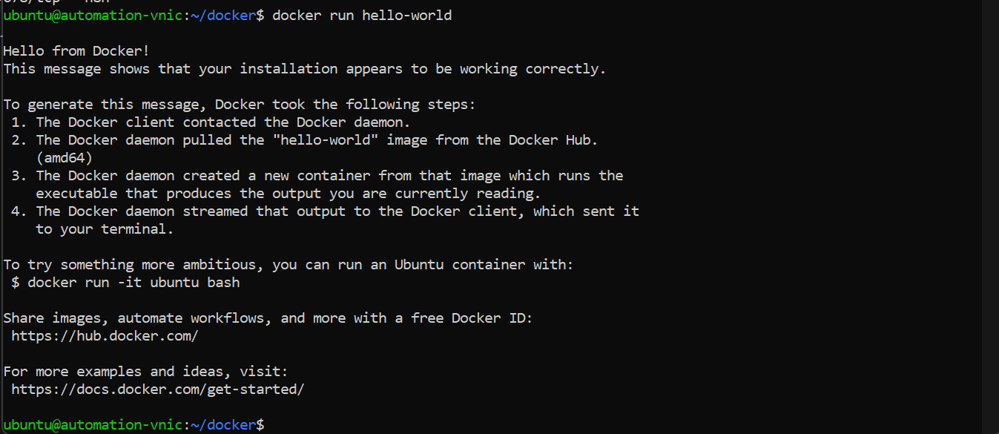

---

# Container Architecture

## Docker Compose Deployment

El despliegue de los servicios se realiza utilizando **Docker Compose**, lo que permite definir y ejecutar múltiples contenedores desde un único archivo de configuración.

El archivo `docker-compose.yml` define los servicios principales de la arquitectura:

- Nginx (Reverse Proxy)
- n8n (Plataforma de automatización)

También se configuran los puertos expuestos, volúmenes persistentes y la red interna que permite la comunicación entre contenedores.

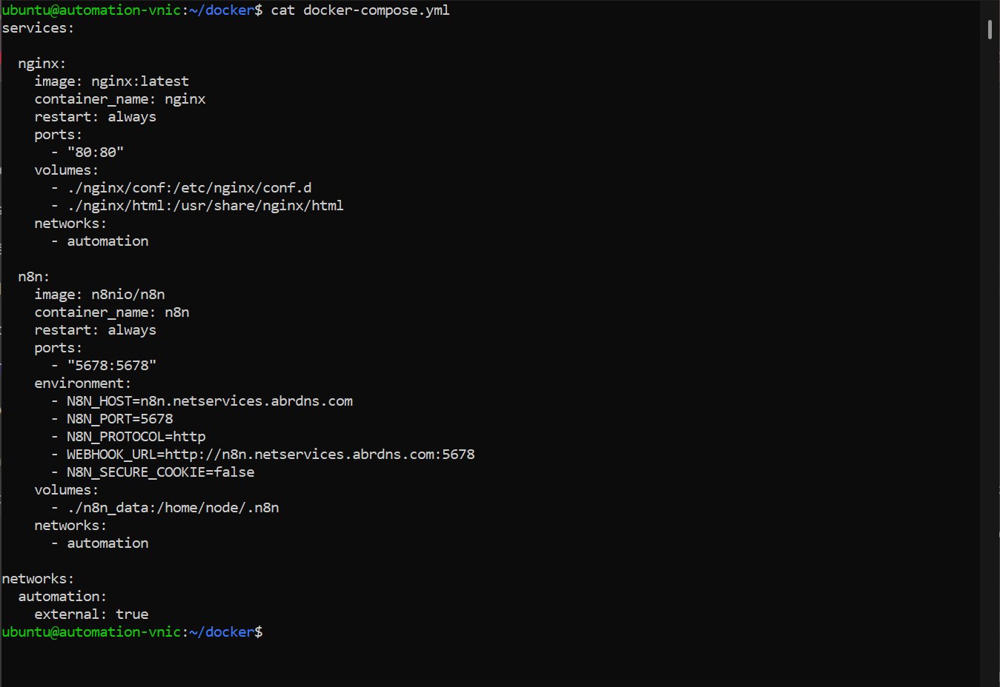

### Bind Mounts (Persistencia de configuración)

La configuración de **Nginx** y el contenido web no se almacenan dentro del contenedor, sino que se gestionan desde el **host mediante bind mounts**.  
Esto permite modificar la configuración y el contenido sin necesidad de reconstruir la imagen del contenedor.

Las siguientes rutas del host se montan dentro del contenedor Nginx:

Host (Oracle VM)

docker/nginx/conf → /etc/nginx/conf.d  
docker/nginx/html → /usr/share/nginx/html

Esto permite:

- Persistencia de configuración
- Edición directa de archivos desde el host
- Separación entre contenedor y datos
- Portabilidad del proyecto entre servidores

## Reverse Proxy

Service: **Nginx**

Functions:

- Web gateway => Puerta de entrada al sistema.
- Entry point for services => Todas las peticiones entrantes son recibidas por Nginx y redirigidas al servicio correspondiente.

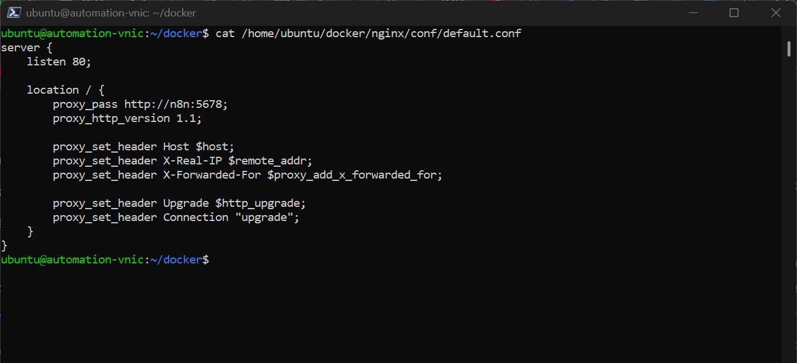

Nginx recibe todas las peticiones HTTP desde Internet y las reenvía al contenedor n8n que escucha en el puerto 5678 dentro de la red interna de Docker.

## Automation Platform

Service: **n8n**

Capabilities:

- Workflow automation engine
- API integrations
- Scheduled workflows
- Continuous execution

---

# DNS Configuration

DNS managed using **ClouDNS**.

Para permitir el acceso público a la plataforma de automatización se configuró un dominio utilizando **ClouDNS** como proveedor DNS.
Se creó un registro **A** que apunta el dominio hacia la dirección IP pública de la máquina virtual en **Oracle Cloud Infrastructure**.

### Registro DNS

Tipo: A  
Host: n8n.netservices.abrdns.com  
Destino: IP pública de la VM en OCI

Ejemplo:

n8n.netservices.abrdns.com → 152.xxx.xxx.xxx

Esto permite acceso público al servicio n8n.
Cuando un usuario accede al dominio, el sistema DNS resuelve el nombre de dominio hacia la dirección IP pública de la máquina virtual.

Flujo de la petición:
Usuario → Resolución DNS → IP pública OCI → Nginx (Reverse Proxy) → Contenedor n8n

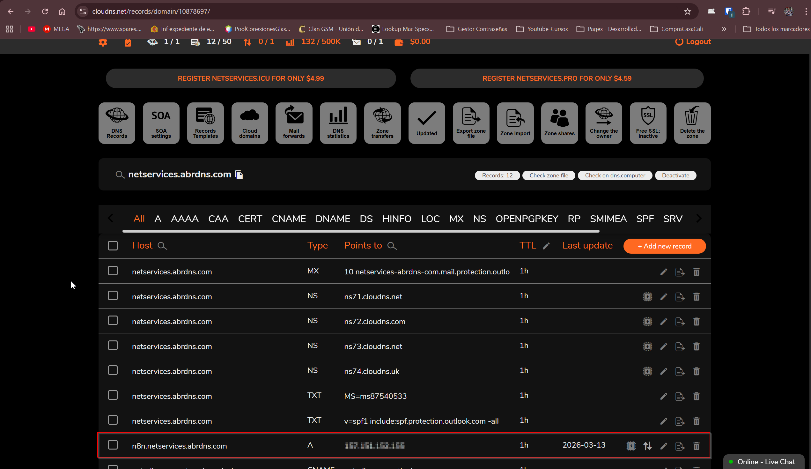

### Variables de entorno de n8n

El dominio configurado en DNS también se utiliza dentro de la configuración
del contenedor n8n mediante variables de entorno definidas en el archivo
`docker-compose.yml`.


Estas variables permiten que n8n genere correctamente URLs públicas,
webhooks y redirecciones OAuth.

Ejemplo de configuración:

environment:

- N8N_HOST=n8n.netservices.abrdns.com
- WEBHOOK_URL=http://n8n.netservices.abrdns.com/

Estas variables aseguran que n8n utilice el dominio público en lugar
de la dirección IP del servidor.
De esta manera, el dominio configurado en ClouDNS se utiliza tanto para
el acceso público al servicio como para la generación de URLs internas
dentro de n8n, como por ejemplo en webhooks o redirecciones OAuth.

---

# Integración con Google OAuth

Para permitir que **n8n** interactúe con **Google Calendar** y **Google Tasks**, se configuró autenticación **OAuth 2.0** mediante **Google Cloud Platform**.

El objetivo es generar un **cliente OAuth** que permita a n8n solicitar autorización para acceder a las APIs de Google en nombre del usuario.

## Pasos realizados

1. Crear un proyecto en **Google Cloud Platform**
2. Habilitar las APIs necesarias:
    - Google Calendar API
    - Google Tasks API
3. Crear un **OAuth Client ID** de tipo **Web Application**
4. Configurar la **Redirect URI** utilizada por n8n

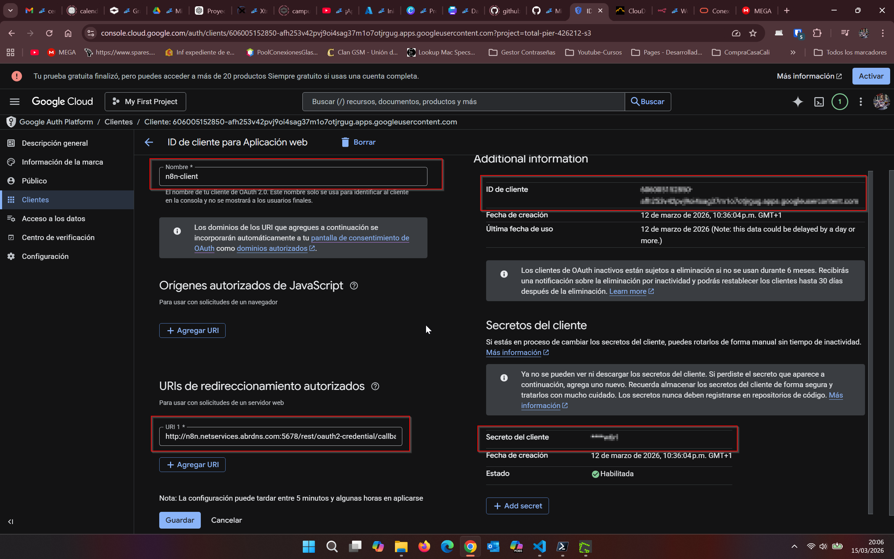

Debemos habiltas estas APIs

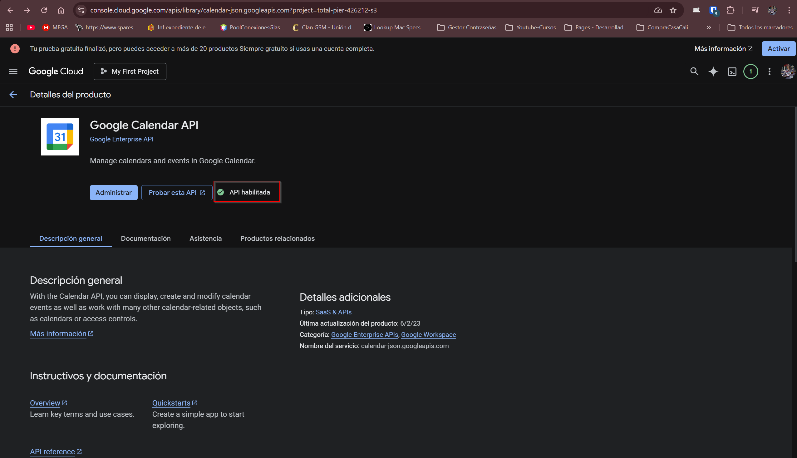

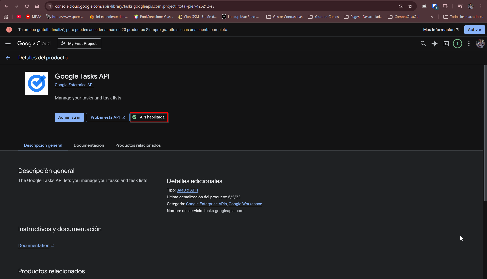

## Redirect URI

http://n8n.netservices.abrnds.com/rest/oauth2-credential/callback

Esta URL es utilizada por **Google OAuth** para redirigir la autorización hacia **n8n** después de que el usuario conceda permisos.

Permite que **n8n** obtenga un token de acceso para interactuar con las APIs habilitadas en el proyecto de Google Cloud, en este caso:

- Google Calendar API
- Google Tasks API

Flujo de autenticación:

n8n → OAuth Client → Google → autorización del usuario → APIs de Google (Calendar / Tasks)

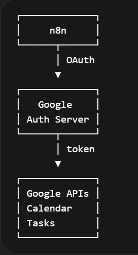

## Conexión de n8n con las APIs de Google

Una vez configurado el cliente OAuth en Google Cloud, se crean las credenciales dentro de **n8n** para permitir la autenticación con las APIs de Google.

En el panel de **Credentials** de n8n se configuran las conexiones para:

- Google Calendar account
- Google Tasks account

Estas credenciales utilizan **OAuth 2.0** y permiten que n8n acceda de forma segura a las APIs de Google utilizando el token obtenido durante el proceso de autorización.

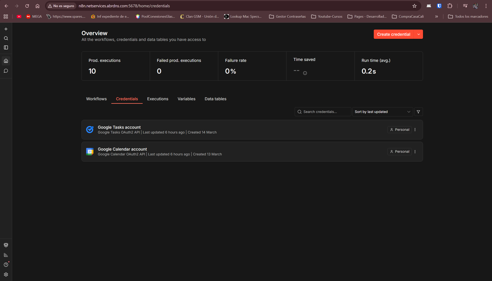

El flujo de autenticación funciona de la siguiente forma:

n8n server → OAuth Client (Google Cloud) → autorización del usuario → token de acceso → Google APIs

Una vez almacenado el token en n8n, el workflow puede interactuar directamente con:

- Google Calendar API
- Google Tasks API

---

# Automation Workflow

Se implementó un workflow en **n8n** que elimina automáticamente eventos y tareas vencidas utilizando las APIs de Google.

## Workflow Logic

Schedule Trigger  
↓  
Get Many Events (Google Calendar)  
↓  
Delete Event  
↓  
Get Many Tasks (Google Tasks)  
↓  
Delete Task

## Execution Schedule

02:00 AM every day

El workflow se ejecuta automáticamente mediante un **Schedule Trigger** configurado en n8n.

## Filtering Logic

Los eventos se filtran utilizando fechas relativas:

from: 7 days ago  
to: 1 day ago

Esto garantiza que solo se eliminen eventos y tareas que ya han expirado.

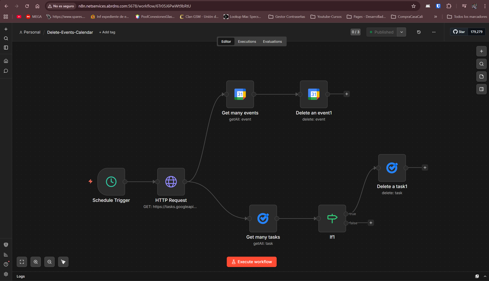

## Workflow Nodes

### Schedule Trigger

Nodo encargado de ejecutar la automatización automáticamente todos los días.

Configuración:

Execution time: 02:00 AM

Trigger type: Scheduled workflow

Este nodo inicia el workflow sin necesidad de intervención manual.

### Get Many Events (Google Calendar)

Este nodo consulta los eventos existentes en Google Calendar utilizando la Google Calendar API.

Su función es recuperar los eventos que coinciden con el rango de fechas definido para identificar eventos expirados.

Operación:

```bash
Resource: Event
Operation: Get Many
```

Filtro aplicado:

```bash
Before: now
```

Esto devuelve únicamente los eventos cuya fecha ya ha pasado.

### Delete Event

Este nodo elimina los eventos obtenidos en el paso anterior.

Cada evento recuperado por el nodo anterior es procesado y eliminado automáticamente mediante la Google Calendar API.

Operación:

```bash
Resource: Event
Operation: Delete
```

### Get Many Tasks (Google Tasks)

Consulta las tareas existentes en Google Tasks utilizando la API correspondiente.

Operación:

```bash
Resource: Task
Operation: Get Many
```

Permite identificar tareas completadas o expiradas.

### Delete Task

Elimina automáticamente las tareas recuperadas en el paso anterior.

Operación:

```bash
Resource: Task
Operation: Delete
```

---

# Result

Limpieza diaria de eventos y tareas vencidos en Google Calendar.

La automatización se ejecuta **24/7 en el servidor cloud sin
intervención manual**.

---

# Technologies Used

- Oracle Cloud Infrastructure
- Ubuntu Linux
- Docker
- Nginx
- n8n
- Google Calendar API
- Google OAuth
- ClouDNS

---

# Skills Demonstrated

- Cloud infrastructure deployment
- Linux system administration
- Docker container orchestration
- DNS configuration
- OAuth authentication
- API integrations
- Workflow automation

---

# Future Improvements

- HTTPS with Let's Encrypt
- Full reverse proxy with Nginx
- Server monitoring
- Additional automation workflows
- Integration with more APIs

---

# Conclusion

Este proyecto demuestra cómo construir una **plataforma de
automatización funcional en la nube utilizando únicamente servicios Free
Tier**, combinando infraestructura, contenedores, APIs y automatización
de workflows.

---

---

# Author

Dagoberto Duran Montoya

Systems Administrator | Cloud | DevOps | Automation

---

# Repository

GitHub Repository:

https://github.com/dakardu/oci-n8n-docker-nginx-automation-cleanup-calendar-events-tasks

---

# License

This project is released under the MIT License.
