# Guía: HTTPS con Let's Encrypt, Nginx y Docker (n8n)

## Arquitectura

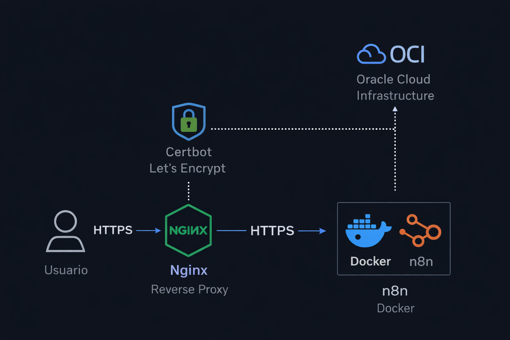

---

Antes de desplegar la infraestructura, es necesario preparar la estructura de directorios donde se almacenarán las configuraciones de Nginx y los certificados de Let's Encrypt.

## 1. Estructura de carpetas

```bash
mkdir -p ~/nginx-letsencrypt
cd ~/nginx-letsencrypt

mkdir nginx
mkdir certbot
```

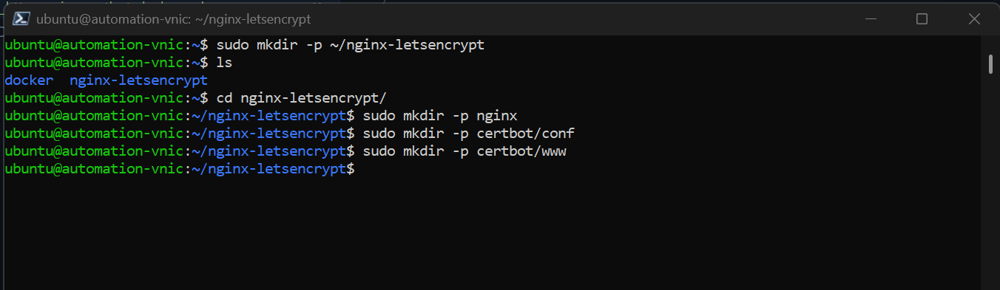

    nginx-letsencrypt/
    │
    ├── docker-compose.yml
    ├── nginx/
    │   └── default.conf
    └── certbot/
        ├── conf/
        └── www/

---

## 2. 🐳 docker-compose.yml

En esta sección se ha modificado el `docker-compose.yml` para soportar tráfico seguro (HTTPS) y permitir la integración con Let's Encrypt mediante Certbot.
Este archivo define los servicios necesarios para desplegar la infraestructura: Nginx como reverse proxy, n8n como aplicación backend y Certbot para la gestión de certificados SSL.

---

### 🔐 Cambios realizados

#### 1. Exposición del puerto 443 (HTTPS)

Se añade el puerto **443** en el contenedor de Nginx para permitir conexiones seguras:

```yaml
ports:
    - "80:80"
    - "443:443"
```

📌 **¿Por qué es necesario?**

- El puerto 80 permite el tráfico HTTP (necesario para el challenge inicial de Let's Encrypt)
- El puerto 443 permite servir contenido cifrado mediante SSL/TLS
- Sin este puerto, HTTPS simplemente no funcionaría

---

#### 2. Volúmenes para certificados y validación

Se añaden volúmenes compartidos entre **Nginx** y **Certbot**:

```yaml
volumes:
    - ./nginx/default.conf:/etc/nginx/conf.d/default.conf
    - ./certbot/conf:/etc/letsencrypt
    - ./certbot/www:/var/www/certbot
```

📌 **¿Qué hace cada uno?**

- `/etc/letsencrypt`
  → Almacena los certificados SSL generados por Let's Encrypt

- `/var/www/certbot`
  → Directorio utilizado para el challenge ACME (verificación del dominio)

- `default.conf`
  → Configuración del reverse proxy en Nginx

---

#### 3. Contenedor de Certbot

Se añade un contenedor dedicado para gestionar los certificados:

```yaml
certbot:
    image: certbot/certbot
```

📌 **Función:**

- Generar certificados SSL
- Renovarlos automáticamente cada 12 horas
- Compartir los certificados con Nginx mediante volúmenes

---

### 🧠 Resultado de estos cambios

Gracias a esta configuración:

✔ Nginx puede servir tráfico HTTPS
✔ Certbot puede validar el dominio
✔ Los certificados se almacenan de forma persistente
✔ La renovación es automática

---

### ⚠️ Nota importante

Los volúmenes son críticos: permiten que **Nginx y Certbot compartan los certificados**.
Sin esto, Nginx no podría acceder a los archivos SSL generados.

---

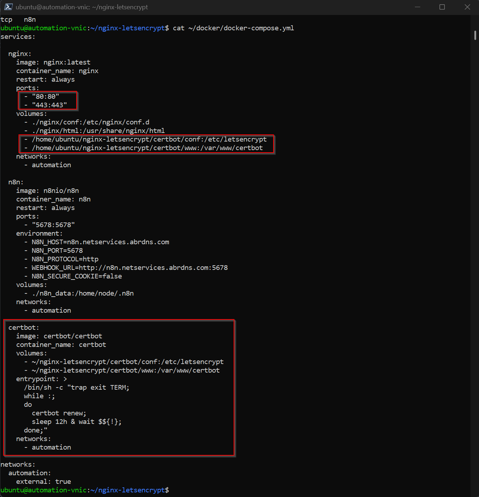

---

# 3. 🌐 Configuración Nginx (HTTP inicial)

Antes de poder generar certificados SSL con Let's Encrypt, es necesario exponer el servicio mediante HTTP.

Esto se debe a que Let's Encrypt valida la propiedad del dominio utilizando el protocolo HTTP (puerto 80) a través del challenge ACME.

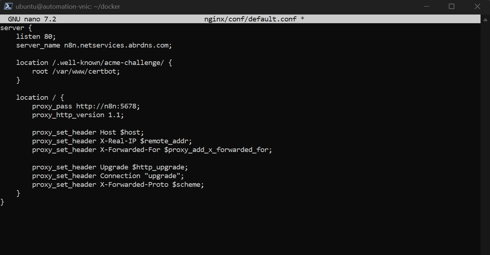

📌 Explicación

listen 80
→ Permite recibir tráfico HTTP necesario para la validación del dominio
/.well-known/acme-challenge/
→ Ruta utilizada por Certbot para verificar que el dominio apunta correctamente al servidor
proxy_pass
→ Redirige el tráfico hacia el contenedor de n8n

🧠 Importante

Esta configuración es temporal y necesaria únicamente para:

✔ Validar el dominio
✔ Generar el certificado SSL

Una vez obtenido el certificado, se configurará HTTPS y se forzará la redirección de HTTP → HTTPS.

---

## 4. Levantar servicios

```bash
docker-compose up -d
```

📌 ¿Aqui ocurre lo siguiente?

- Se crean y arrancan los contenedores:
    - Nginx (reverse proxy)
    - n8n (aplicación)
    - Certbot (gestión SSL)

- Nginx comienza a escuchar en el puerto 80

- El sistema queda preparado para la validación del dominio

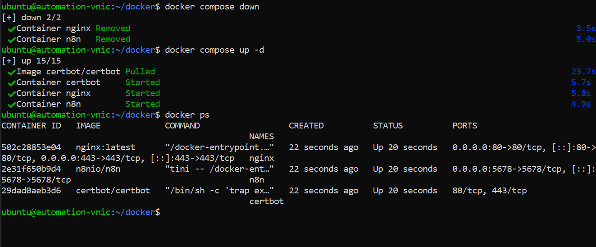

---

## 5. Obtener certificado

```bash
docker-compose run --rm certbot certonly \
  --webroot \
  --webroot-path=/var/www/certbot \
  -d tu-dominio.com \
  --email tu-email@correo.com \
  --agree-tos \
  --no-eff-email
```

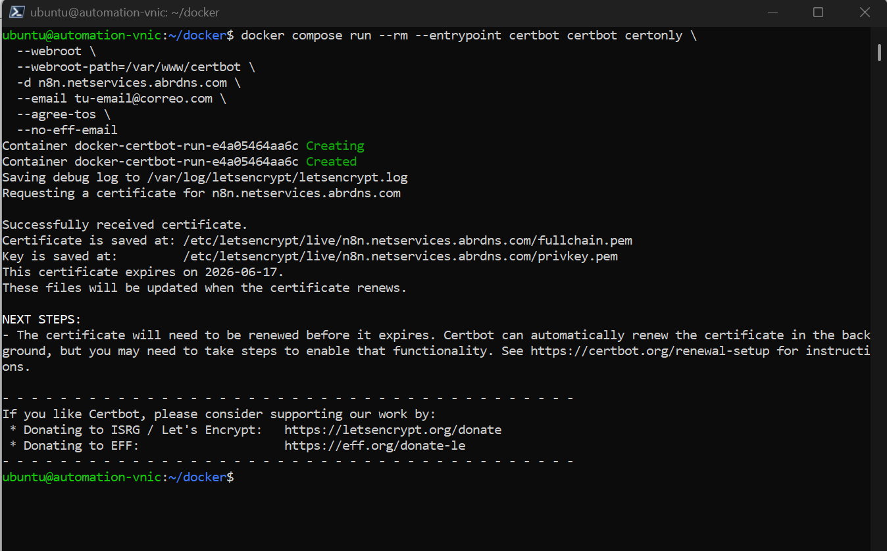

---

## 6. Configuración HTTPS

Una vez obtenido el certificado SSL, se procede a configurar Nginx para servir tráfico seguro mediante HTTPS.

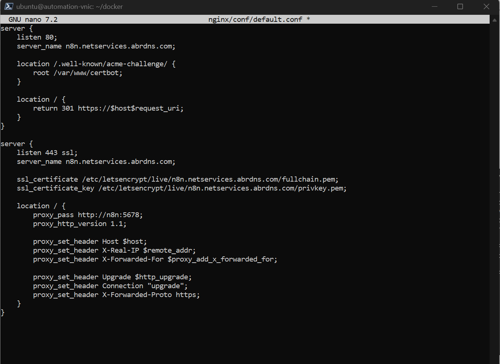

🔁 Redirección HTTP → HTTPS
return 301 https://$host$request_uri;

📌 ¿Qué hace esto?

- Redirige automáticamente todo el tráfico HTTP al protocolo HTTPS
- Garantiza que todas las conexiones sean seguras
- Mejora la seguridad y buenas prácticas (HSTS-ready)

🔐 Certificados SSL

ssl_certificate /etc/letsencrypt/live/tu-dominio.com/fullchain.pem;
ssl_certificate_key /etc/letsencrypt/live/tu-dominio.com/privkey.pem;

📌 Explicación:

fullchain.pem → Certificado público + cadena de confianza
privkey.pem → Clave privada del servidor

🌐 Headers de proxy (muy importante)
proxy_set_header X-Forwarded-Proto https;
proxy_set_header X-Forwarded-For $proxy_add_x_forwarded_for;

📌 ¿Por qué son importantes?

- Permiten que aplicaciones como n8n sepan que están detrás de HTTPS
- Evitan problemas con:
    - OAuth ❌
    - Webhooks ❌
    - Generación de URLs incorrectas ❌

🧠 Flujo de funcionamiento

1. El usuario accede vía HTTP o HTTPS
2. Si usa HTTP → Nginx redirige a HTTPS
3. Nginx termina la conexión SSL (TLS termination)
4. Reenvía la petición a n8n (puerto interno 5678)
5. n8n responde
6. Nginx devuelve la respuesta cifrada al cliente

⚠️ Problemas comunes

- ❌ No configurar redirección → tráfico inseguro
- ❌ Certificados mal montados → error SSL
- ❌ Headers incorrectos → OAuth falla

---

## 7. Reiniciar Nginx

```bash
docker-compose restart nginx
```

---

## 8. Renovación automática

Incluida en el contenedor certbot (cada 12h).

---

## 9. 🔓 Apertura de puertos en Oracle Cloud (OCI)

Antes de verificar el acceso HTTPS, es necesario permitir el tráfico en los puertos 80 y 443 desde la red externa.

Por defecto, Oracle Cloud bloquea estos puertos a nivel de red, por lo que es imprescindible habilitarlos manualmente.

---

### 📌 Puertos necesarios

- **80 (HTTP)** → Necesario para el challenge de Let's Encrypt
- **443 (HTTPS)** → Necesario para el acceso seguro al servicio

---

### ⚙️ Configuración en OCI

1. Acceder a la consola de Oracle Cloud
2. Ir a la VCN correspondiente
3. Seleccionar el **Security List** o **Network Security Group (NSG)**
4. Añadir reglas de entrada (Ingress Rules):

| Puerto | Protocolo | Origen    |
| ------ | --------- | --------- |
| 80     | TCP       | 0.0.0.0/0 |
| 443    | TCP       | 0.0.0.0/0 |

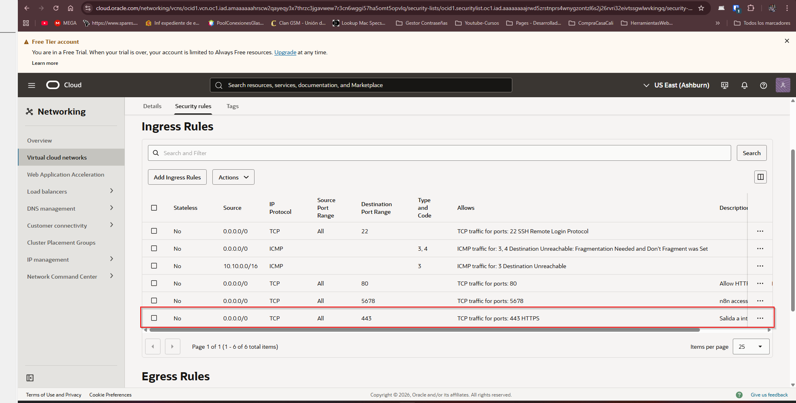

---

### 🧠 Importante

Si el puerto **443 no está abierto**, el navegador no podrá establecer conexión HTTPS, aunque el certificado SSL esté correctamente configurado.

---

Abrir:

    https://n8n.netservices.abrdns.com/

✔ HTTPS activo\
✔ Redirección HTTP → HTTPS\
✔ n8n funcionando

---

## 🔑 Configuración de URL pública en n8n

Para que n8n funcione correctamente con HTTPS, webhooks y autenticación OAuth (por ejemplo con Google), es necesario configurar la URL pública del servicio.

---

## 10. ✅ Verificación

### 🌐 1. Variables de entorno en Docker

En el `docker-compose.yml`, se deben definir las siguientes variables y nos aseguramos de no utilizar el puerto 5678 directamente desde el exterior:

```yaml
environment:
    - N8N_HOST=n8n.netservices.abrdns.com
    - N8N_PROTOCOL=https
    - WEBHOOK_URL=https://n8n.netservices.abrdns.com/
    - N8N_SECURE_COOKIE=true
```

🧠 Importante

Esta configuración es crítica cuando n8n se ejecuta detrás de un reverse proxy como Nginx.

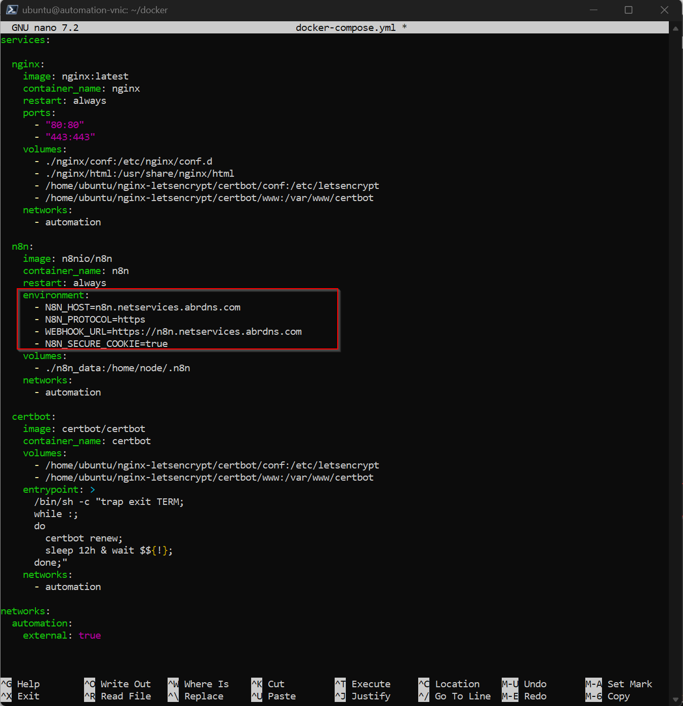

### 📌 ¿Qué hace cada variable?

- **N8N_HOST**
  → Define el dominio público del servicio

- **N8N_PROTOCOL**
  → Fuerza el uso de HTTPS en las URLs generadas

- **WEBHOOK_URL**
  → URL base utilizada para webhooks y callbacks

- **N8N_SECURE_COOKIE**
  → Asegura que las cookies solo se envíen por HTTPS

---

### 🔐 2. URL de redirección OAuth

Cuando se configura OAuth (por ejemplo Google), se debe usar la siguiente URL de redirección:

```bash
https://n8n.netservices.abrdns.com/rest/oauth2-credential/callback
```

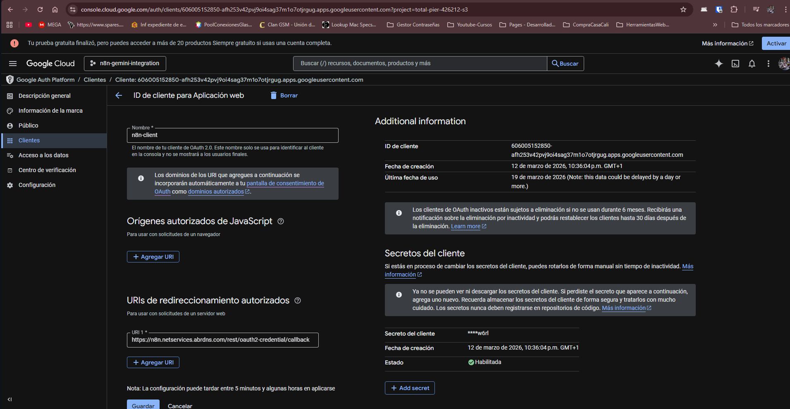

### ⚠️ Problema común

Si n8n no está correctamente configurado:

- Generará URLs con `http://` ❌
- Usará `localhost:5678` ❌
- OAuth fallará ❌

---

### 🧠 Solución

Estas variables aseguran que:

✔ n8n reconozca su dominio público
✔ OAuth funcione correctamente
✔ Los webhooks sean accesibles desde internet
✔ Toda la comunicación use HTTPS

---

### 🔄 Aplicar cambios

Después de modificar las variables:

```bash
docker-compose up -d --force-recreate n8n
```

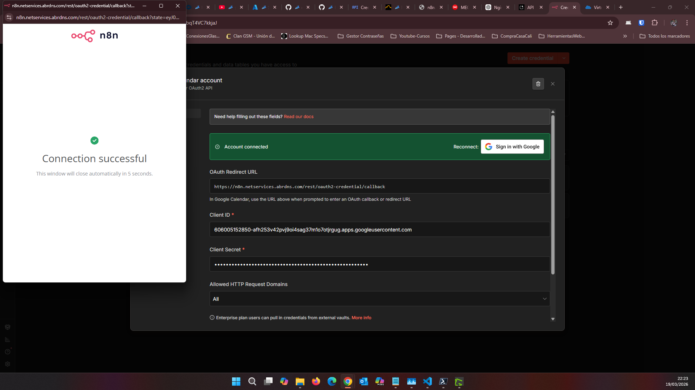

---

## 📌 Consideraciones finales

- Asegurar la apertura de puertos 80 y 443 en Oracle Cloud (OCI)
- Configurar correctamente el firewall del sistema (ufw)
- Si se utiliza Cloudflare, establecer el modo **DNS only** durante la validación de certificados

---

## 👨‍💻 Autor

**Dagoberto Durán Montoya**
Administrador de Sistemas | Cloud & DevOps

---

## 📄 License

This project is released under the MIT License.
